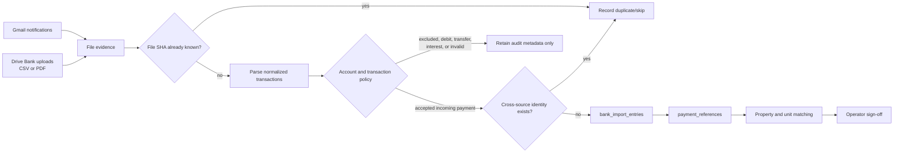
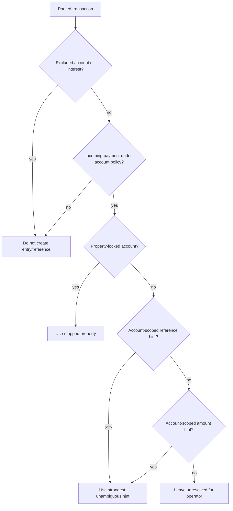

Last updated: 2026-07-12

# Architecture

This is the structural view of the app: what runs where, what talks to what, and where
each capability's code lives. Pair this with [REQUIREMENTS.md](./REQUIREMENTS.md) (what
it must do) and [ROADMAP.md](./ROADMAP.md) (build order and status).

## 1. System overview

A single Next.js 16 (App Router, Turbopack) app, deployed to Vercel, backed by one
Supabase project. Two top-level product surfaces branch from `/`:

```
                        ┌────────────┐
                        │   /  entry │
                        └─────┬──────┘
              ┌───────────────┴───────────────┐
     ┌────────▼─────────┐            ┌────────▼─────────┐
     │ Property          │            │ Monthly Payments  │
     │ Assistance         │            │ (operator loop)   │
     │ (chatbot workspace)│            │                   │
     └────────┬───────────┘            └────────┬──────────┘
              │                                 │
     ┌────────▼───────────┐            ┌────────▼──────────────────┐
     │ KB + vector search  │            │ Bank import (Gmail/Drive) │
     │ LLM chat (OpenAI /  │            │ → property_units /        │
     │ Anthropic/DeepSeek) │            │   payment_references      │
     └────────┬───────────┘            └────────┬──────────────────┘
              │                                 │
              └───────────────┬─────────────────┘
                               │
                     ┌─────────▼─────────┐
                     │ Supabase (Postgres │
                     │ + pgvector + Auth  │
                     │ + Storage)         │
                     └────────────────────┘
```

A third planned surface, the **WhatsApp tenant assistant**, sits conceptually beside
these two (guardrailed LLM conversations for inquiring/servicing/leaving tenants) but
has no shipped code yet — see [whatsapp-tenant-assistant.md](./roadmap/functionality/whatsapp-tenant-assistant.md).

## 2. Deployment / environment

| Layer | Provider | Notes |
|---|---|---|
| App hosting | Vercel (`whatsapp-project`) | Production **READY**, but missing prod env vars (Linear **AUT-14**) |
| Database | Supabase (`hambatrading`, ref `ddlykzackuehdexldazv`, eu-central-1) | `ACTIVE_HEALTHY` |
| Auth | Supabase Auth | Google OAuth + email/password |
| File storage | Supabase Storage | `uploads` bucket (private, KB docs); `property-images` bucket planned |
| External APIs | OpenAI, Anthropic, DeepSeek (LLM); Gmail API + Google Drive API (bank import) | Key resolution: DB `prompt_settings.llm_api_key` > env var |

Local dev target is `http://localhost:3000` (see HANDOFF.md §7 — a stray `3001`
reference in older docs is stale).

## 3. Auth architecture

Next 16 uses `proxy` (not `middleware`):

- `src/proxy.ts` — refreshes the Supabase session per request; unauthenticated users
  are redirected to `/login` (pages) or `401`'d (`/api/*`).
- `src/lib/supabase/{env,client,server,proxy}.ts` — SSR Supabase clients.
- `src/lib/auth/dal.ts` — `getUser()`, `requireUser()`, `getApiUser()`.
- `src/lib/auth/api-guard.ts` — `requireApiAuth()`, applied to every API route.
- `src/app/login/`, `src/app/auth/callback/`, `src/app/auth/signout/`, `src/app/auth-test/`.

A local-only auth bypass exists (`NEXT_PUBLIC_LOCAL_AUTH_BYPASS=true`, non-production
only) to let browser automation exercise protected routes.

## 4. Capability 1 — Property Assistance (chatbot workspace)

**Routes:** `src/app/organizations/[organizationId]`, `src/app/properties/[propertyId]`,
`src/app/properties/[propertyId]/chatbot`, `src/app/property-assistance`.

**API:** `api/chat`, `api/history`, `api/models`, `api/settings/prompt`, `api/workspace`,
`api/kb/{search,list,upload,update,delete}`, `api/analytics/overview`.

**Data model** (`supabase/schema.sql`, `supabase/workspace-schema.sql`):
`organizations`, `properties`, `property_chatbot_settings`, `customers`,
`conversations`, `messages`, `prompt_settings`, `knowledge_base`, `knowledge_vectors`
(pgvector, 768-dim, HNSW cosine index), `property_media`.

**Pipeline:** upload → parse (`src/lib/kb/sources.ts`, lazy-loaded parsers for
PDF/DOCX/XLSX/CSV/HTML/text) → chunk → embed (OpenAI `text-embedding-3-small`,
768 dims) → store in `knowledge_vectors`, scoped by `organization_id`/`property_id` →
`retrieveKnowledge` (`src/lib/kb/vector.ts`) called directly (no internal HTTP
round-trip) from `/api/chat`, which supports memory modes `hybrid` / `rolling_window`
/ `retrieval_only` (`summary_memory` currently falls back to `hybrid` pending a
lifecycle decision — see [vector-embeddings.md](./roadmap/functionality/vector-embeddings.md)).

## 5. Capability 2 — Monthly Payments (operator loop)

**Routes:** `src/app/monthly-payments`, `.../[propertyId]`, `.../locations`,
`.../locations/[propertyId]` (room manager), `.../reference-pool` (now a
support/debug surface, not the v1 primary path).

**API:** `api/monthly-payments/import` (+ `import/google-cloud`),
`api/monthly-payments/references` (`match` / `sign_off` / `reverse_sign_off`),
`api/monthly-payments/rooms` (create + update).

**Data model:** `property_units` (unit/room + `expected_reference` +
`match_keywords[]` + regex hints), `unit_payment_periods` (per-period expected
amount/status/due_date), `payment_references` (imported deposits; `unit_id` /
`unit_payment_period_id` when matched; `signed_off`/`signed_off_at`/`signed_off_by`;
`matched_at`/`matched_by`/`match_method`), `payment_match_events` (append-only audit
log: matched/unmatched/signed_off/reverse_signed_off/blocked/unblocked/status_changed).

**State machine** (`src/lib/monthly-payments-ops.ts`):
`ensurePaymentPeriodsForPeriod` → `matchReferenceToUnit` → `signOffMatchedReference`
→ `reverseSignOffAndUnmatch` (drops a reference back into the pool, unlocks the row).
Status is mostly **derived at read time** in `src/lib/monthly-payments.ts`
(mismatch/overdue/partial/paid), not stored directly.

**Bank import pipeline** (`src/lib/bank-import.ts`):



The cross-source identity is account suffix + transaction time/date + amount +
canonical reference. This prevents a statement row from duplicating the same payment
already received as a Gmail PDF. File SHA dedupe remains a separate layer so renamed
copies of the same statement do not create another import.



**Ownership and read models:**

| Concern | Source of truth | Read surfaces |
|---|---|---|
| Source files and parser evidence | `bank_import_messages`, `bank_import_files` | Import audit |
| Accepted normalized transactions | `bank_import_entries` | Import audit |
| Account/property routing | `bank_import_property_mappings` plus source-controlled account policy | Import configuration |
| Unit matching knowledge | `bank_import_unit_match_hints`, `property_units.match_keywords`, match rules | Import configuration, room manager |
| Operator reconciliation | `payment_references`, `unit_payment_periods`, `payment_match_events` | Reference pool, unit table, import audit |

The audit and configuration pages do not own another copy of payment state. Import
audit is a current-state provenance join; import configuration explains the policies
that produced that state. Reference pool remains the action surface for unresolved
references.

Billing window rule: **9th of the previous month → 8th of the selected month**.
Current masked-account register:

| Suffix | Role |
|---|---|
| `2815`, `6088` | Quarry Heights dedicated/legacy |
| `4079`, `9613` | West Rich dedicated/legacy; `9613` is property-locked |
| `7904` | Essex/Berea; property-locked |
| `6570` | Mixed legacy Quarry Heights/West Rich; routed by account-scoped reference, then amount |
| `7467` | Internal/excluded; never creates entries or payment references |

Drive is bidirectional operationally: Gmail imports can archive into Drive, while
files deliberately placed in the Bank uploads folder can be imported back into
Supabase with `source=bank` (note: `source=both` means Gmail + the app's own
Drive archive; it deliberately does not sweep the operator-managed Bank uploads
folder, so those imports are always an explicit action).

## 6. Capability 3 — WhatsApp Tenant Assistant (planning only)

No shipped code. Planned to reuse the KB/LLM pipeline above with guardrails and a
decision-tree router (greet → intent → interested/servicing/leaving → human
takeover). See [whatsapp-tenant-assistant.md](./roadmap/functionality/whatsapp-tenant-assistant.md)
and [tenant-conversation-flows.md](./roadmap/functionality/tenant-conversation-flows.md).
The original Twilio implementation was removed in the 2026-05-30 repo flatten;
recovery reference: `git show 569efde:SAWhatsApp/platform/<path>`. Direction
confirmed by the owner: rebuild into `src/` (resolves Linear **AUT-15**).

## 7. UI layer

- Component library: **HeroUI v3** (`@heroui/react`), adopted starting with the login
  form — see [heroui.md](./roadmap/ui/heroui.md).
- Forms follow the [forms enhancement protocol](./roadmap/ui/forms.md) (validation,
  typed inputs, upload progress, accessibility, multi-step wizards) — not yet
  uniformly applied.
- Icons: Lucide, via `src/components/workspace/workspace-route.tsx`.
- Current design direction (from the 2026-07-01 UI review): denser, less decorative,
  operations-tool feel — see [monthly-payments-ui-flow-review-2026-07-01.md](./audits/monthly-payments-ui-flow-review-2026-07-01.md).

## 8. Tooling / build

- `scripts/check-runtime.mjs` — guards Node ≥22, npm ≥10 on predev/prebuild/prestart/prelint.
- `scripts/audit-vector-pipeline.mjs` — automated KB/vector pipeline audit (`npm run
  audit:vector-pipeline`), latest run: 0 findings / 32 checks.
- `scripts/transcribe.mjs` — voice-note → text via OpenAI `gpt-4o-transcribe`
  (`npm run transcribe -- "<file>"`); the owner's primary offline planning channel,
  transcripts land in `docs/voice-notes/`.
- Playwright e2e suite in `e2e/` (see [monthly-payments-flow-tests.md](./testing/monthly-payments-flow-tests.md)
  for the flow-first test plan behind it).
- Framework caveat: this is a **modified Next.js** with breaking changes vs. stock —
  read `node_modules/next/dist/docs/` before writing Next code (see `AGENTS.md`).

## 9. Known architectural debt

1. `supabase/schema.sql` and `supabase/workspace-schema.sql` are not fully unified
   (Linear **AUT-9**).
2. One migration (`add_drive_archive_tracking_to_bank_import_files`) was applied
   live via MCP but has no local migration file yet — backfill needed.
3. `public.prompt_settings` has RLS disabled (Supabase advisory, unresolved).
4. Bank import currently runs synchronously in the request path. Large statement
   batches should move to a durable import-run/job model with retry and progress.
5. Import audit shows current file/transaction state but has no first-class import
   run ledger, and duplicate rows do not yet retain a durable link to the canonical
   transaction they were reconciled against.
6. Account policy is intentionally split between source-controlled safety rules and
   database mappings/hints. If operators need to edit policy, introduce a validated
   admin workflow rather than making the read-only configuration page writable.
7. Combined payments for more than one room remain human-reviewed; allocation of one
   bank reference across multiple units is not implemented.
