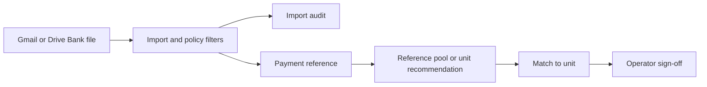

# Full Flow Review — Monthly Payments Import Flow

Date: 2026-07-12  
Verdict: **Ship with caveats**

## Scope

Reviewed the controlled Gmail/Drive bank import, Import audit, Import
configuration, Reference pool handoff, account/property routing, unit matching,
and the July live-data reconciliation. This is a multi-screen and data-policy
change, so the review covers architecture, QA/import health, UI/accessibility, and
roadmap fit.

## 1. Architecture and Product Flow

The happy path is real and connected:

- There is no phantom local-upload step. Drive access controls who can add fallback
  statements; the application imports from that controlled folder.
- Import audit is evidence and validation, not a second matching workflow.
- Import configuration explains source-controlled and database-backed policy; it is
  deliberately read-only.
- Reference pool and unit tables remain the action surfaces.
- Occupancy and matching views now share common unit-display and recommendation
  helpers, removing the contradictory vacant/occupied and Room07 recommendation
  behavior seen during the session.

Architecture caveats: imports are synchronous, there is no first-class import-run
ledger, duplicate skips do not link to a canonical transaction, and account policy
is split between code configuration and database mappings/hints.

## 2. QA and Import Health

Automated checks on the final working tree:

- `npm test`: **128/128 passed**
- `npm run typecheck`: passed
- `npm run build`: passed; all 29 application routes compiled and rendered
- Focused Playwright import/audit/configuration journey: **2/2 passed**
- Source lint (`src`, `e2e`, and `playwright.config.ts`): zero errors, 10 pre-existing warnings
- `git diff --check`: passed
- Route render tests cover Import audit and Import configuration.
- Domain tests cover CSV/PDF parsing, timestamps, billing windows, interest/internal
  account exclusions, mixed-account rules, property locks, cross-source identity,
  canonical references, zero-padded room matching, and combined-room ambiguity.

Live July Drive verification after reconciliation:

- 4 bank files; 23 accepted transactions; R56,700 total
- 23/23 transactions present in the database
- 18 matched/signed-off
- internal account `7467`: zero entries/references
- interest received: zero entries/references
- mixed account `6570`: 29 historical entries totaling R65,100; 28 matched; one
  combined-room R4,400 payment intentionally unmatched

The focused read-only Playwright journey now covers dashboard -> Import audit ->
Import configuration -> Reference pool -> dashboard, plus the shared six-item
navigation across every monthly-payments workspace. The full historical Playwright
suite was not run; that remains the principal verification gap.

## 3. UI and Accessibility

Manual live review found the flow readable at operational density. Filters use
standard form controls, status is expressed with text as well as color, file details
are collapsible, links retain source context, and the new pages use the shared
payments navigation. Screenshots:

- `docs/audits/screenshots/2026-07-12-import-audit-before-reference-pool-live.png`
- `docs/audits/screenshots/2026-07-12-import-audit-after-live.png`
- `docs/audits/screenshots/2026-07-12-import-configuration-live.png`

A formal design-plugin accessibility review was not available in this session.
Keyboard traversal and screen-reader announcements for expanded file details remain
residual risk.

## 4. Roadmap and Requirements Fit

The work directly supports the current monthly-payments stabilization goal: knowing
which payments arrived, where they came from, whether they exist in the database,
and whether they are matched. Requirements FR-2.11 through FR-2.15 now describe the
shipped reverse import, audit, configuration, dedupe, and account policy.

Live Linear was unavailable because the connector is not authorized. `LINEAR-SYNC.md`
therefore records three ticket gaps for later reconciliation: account-policy
ownership, combined-payment allocation, and import-flow browser coverage.

## Cross-Lens Tensions

- Live-data QA and the focused browser journey are strong, while the broader
  historical Playwright suite remains outside this release gate.
- The current-state audit answers “what exists now” well, but cannot yet answer
  “what happened in import run X” as an immutable history.
- Safety rules belong in controlled configuration today, but the split between code
  and database can drift if policy changes become frequent.

## Prioritized Actions

| Priority | Action | Why |
|---|---|---|
| P1 | Add seeded Playwright coverage for Drive import → audit → match | Makes the verified live flow repeatable. |
| P1 | Add durable import runs/jobs and canonical duplicate links | Provides retry, progress, and historical reconciliation. |
| P1 | Define combined-payment split workflow | Resolves the valid R4,400 two-room case without guessing. |
| P2 | Reconcile/create Linear tickets once authorized | Restores delivery ownership and status visibility. |
| P2 | Decide whether account policy needs validated operator editing | Avoids premature admin complexity while preventing config drift. |

## Screenshot Checklist

- Import audit, collapsed and expanded file: captured
- Import configuration account/policy register: captured
- Reference pool transition for unmatched combined payment: not captured
- Narrow/mobile visual validation: captured for the entry, dashboard, locations,
  and chatbot workspace; keyboard-only validation remains outstanding
