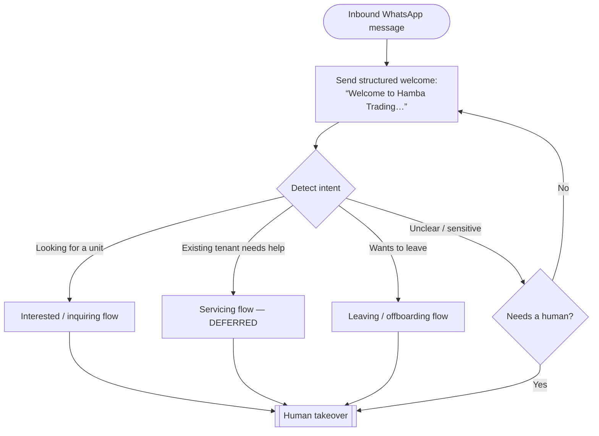
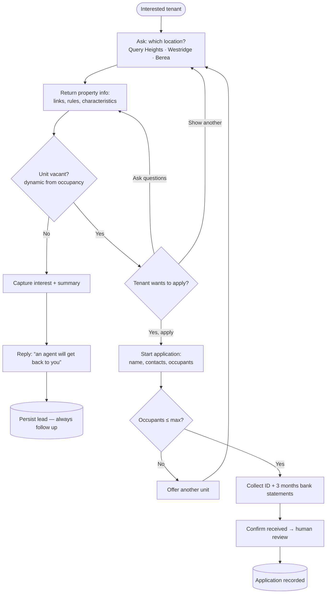
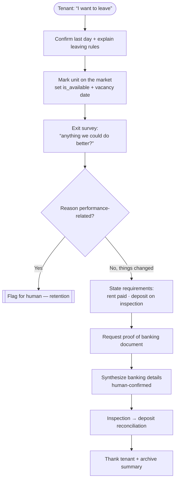
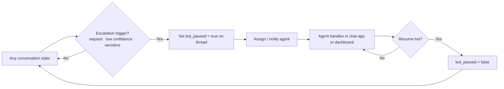

# Tenant Conversation Flows (Decision Trees)

> Derived from [2026-06-14 La Lucia Mall session](../../voice-notes/2026-06-14-la-lucia-mall-16.md).
> Status: **planning only — not approved for build.** These are the decision trees
> behind the [WhatsApp tenant assistant](./whatsapp-tenant-assistant.md),
> [payments dashboard](./payments-dashboard.md), and
> [tenant offboarding](./tenant-offboarding.md). Diagrams use Mermaid (renders on
> GitHub / most Markdown viewers).

## 1. Inbound routing — top-level decision tree

Every inbound WhatsApp message is greeted, then classified into one of three tenant
states (or escalated to a human at any point).

## 2. Interested / inquiring flow (build first)

> Guardrails: answer property questions only up to defined limits (rent, deposit,
> parking, children rules, vacancy); escalate anything outside them. Vacancy should
> reflect live occupancy and in-flight leaving processes.

## 3. Leaving / offboarding flow

> Sensitive-data guardrails: banking/ID documents go to the **private** `uploads`
> bucket; never echo full account/ID numbers in chat; don't promise a deposit amount
> before inspection.

## 4. Human takeover (applies to every state)

## How these map to data & build

- **States & lead/summary** → conversations/messages + a `bot_paused` flag and a
  lead/summary record (see [WhatsApp tenant assistant](./whatsapp-tenant-assistant.md)).
- **Vacancy & property info** → structured property/unit data
  ([property details](./property-details.md)).
- **Application uploads / proof of banking** → private `uploads` bucket
  ([storage](./storage.md)); document parsing reuses `src/lib/kb/sources.ts`.
- **Deposit ↔ rent reconciliation** → [payments dashboard](./payments-dashboard.md).

## Open questions (need owner input / more voice notes)

1. Exact intent-classification triggers per state (keywords vs. LLM classifier).
2. Escalation triggers that should force human takeover.
3. Whether applications live in the chat app, the dashboard, or both.
4. Notice-period and pro-rata rent policy specifics.
